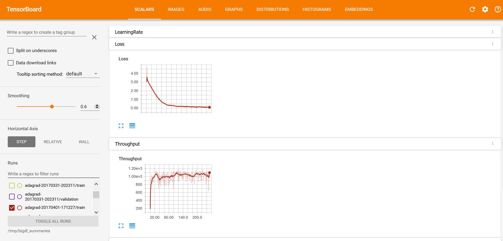

---
# **Visualization with TensorBoard**

## **Generating summary info in BigDL**
To enable visualization support, you need first properly configure the `Optimizer` to generate summary info for training (`TrainSummary`) and/or validation (`ValidationSummary`) before invoking `Optimizer.optimize()`, as illustrated below: 

_**Generating summary info in Scala**_
```scala
val optimizer = Optimizer(...)
...
val logdir = "mylogdir"
val appName = "myapp"
val trainSummary = TrainSummary(logdir, appName)
val talidationSummary = ValidationSummary(logdir, appName)
optimizer.setTrainSummary(trainSummary)
optimizer.setValidationSummary(validationSummary)
...
val trained_model = optimizer.optimize()
```
_**Generating summary info in Python**_
```python
optimizer = Optimizer(...)
...
log_dir = 'mylogdir'
app_name = 'myapp'
train_summary = TrainSummary(log_dir=log_dir, app_name=app_name)
val_summary = ValidationSummary(log_dir=log_dir, app_name=app_name)
optimizer.set_train_summary(train_summary)
optimizer.set_val_summary(val_summary)
...
trainedModel = optimizer.optimize()
```
After you start to run your spark job, the train and validation summary will be saved to `mylogdir/myapp/train` and `mylogdir/myapp/validation` respectively (Note: you may want to use different `appName` for different job runs to avoid possible conflicts.) You may then read the summary info as follows:

_**Reading summary info in Scala**_
```scala
val trainLoss = trainSummary.readScalar("Loss")
val validationLoss = validationSummary.readScalar("Loss")
...
```

_**Reading summary info in Python**_
```python
loss = np.array(train_summary.read_scalar('Loss'))
valloss = np.array(val_summary.read_scalar('Loss'))
...
```

## **Visualizing training with TensorBoard**
With the summary info generated, we can then use [TensorBoard](https://pypi.python.org/pypi/tensorboard) to visualize the behaviors of the BigDL program.  

### **Installing TensorBoard**
Prerequisites:
* Python verison: 2.7, 3.4, 3.5, or 3.6
* Pip version >= 9.0.1

To install TensorBoard using Python 2, you may run the command:
```bash
pip install tensorboard==1.0.0a4
```

To install TensorBoard using Python 3, you may run the command:
```bash
pip3 install tensorboard==1.0.0a4
```

Please refer to [this page](https://github.com/intel-analytics/BigDL/tree/master/spark/dl/src/main/scala/com/intel/analytics/bigdl/visualization#known-issues) for possible issues when installing TensorBoard.

### **Launching TensorBoard**
You can launch TensorBoard using the command below:
```
tensorboard --logdir=/tmp/bigdl_summaries
```
After that, navigate to the TensorBoard dashboard using a browser. You can find the URL in the console output after TensorBoard is successfully launched; by default the URL is http://your_node:6006

### **Visualizations in TensorBoard**
Within the TensorBoard dashboard, you will be able to read the visualizations of each run, including the “Loss” and “Throughput” curves under the SCALARS tab (as illustrated below):


And “weights”, “bias”, “gradientWeights” and “gradientBias” under the DISTRIBUTIONS and HISTOGRAMS tabs (as illustrated below):


---